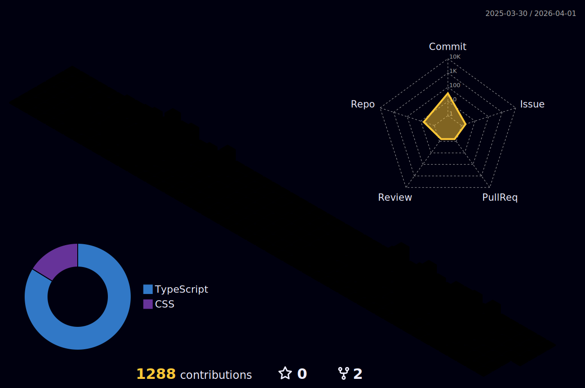

|  |  |
| ------------------------------------------------------------------------------------------------------------------------------------------------------------------------------------------------------ | ----------------------------------------------------------------------------------------------------------------------------------------------------------------------------------------- |

  

<a href="https://skillicons.dev"   >
 <!-- Linguagens -->
  
  
  
  
  
  
   
    <!-- Frontend -->
  
  
  
  
  
  
   
  
  
  
  
  
  
   
  <!-- Backend & DevOps -->
  
  
  
  
  
  
   
  
  
  
  
  
  
   
  <!-- Banco de Dados -->
  
  
  
  
   
    <!-- IA & Visão Computacional -->
  
  
  
   
  <!-- Redes Sociais -->

</a>
   

  

##

   

     
  

