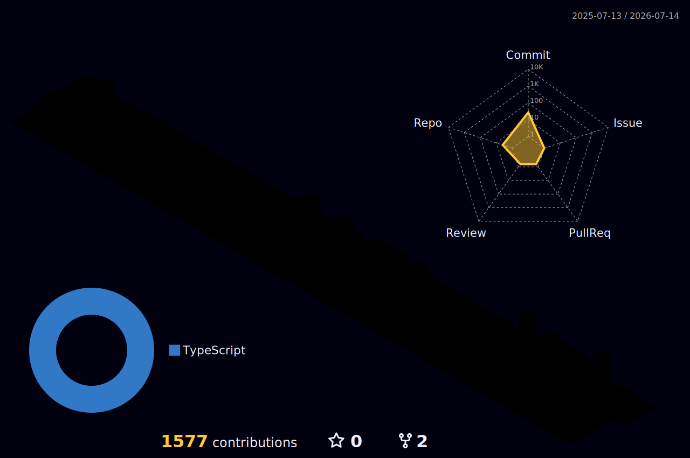

# Breno Cocheto
**Engenheiro de Software Full Stack | Arquitetura, Integrações e DevOps**

Desenvolvo, integro e sustento aplicações web e ecossistemas de software ponta a ponta.  
Atuo com foco em desenvolvimento full stack, arquitetura de soluções, automações, APIs, infraestrutura e operação.

## Conecte-se

## Stack principal

  

## Áreas de atuação

- Desenvolvimento Full Stack
- Arquitetura de Software
- Integração entre Sistemas
- APIs e Webhooks
- Automação de Processos
- DevOps e Sustentação de Ambientes

## GitHub Insights

